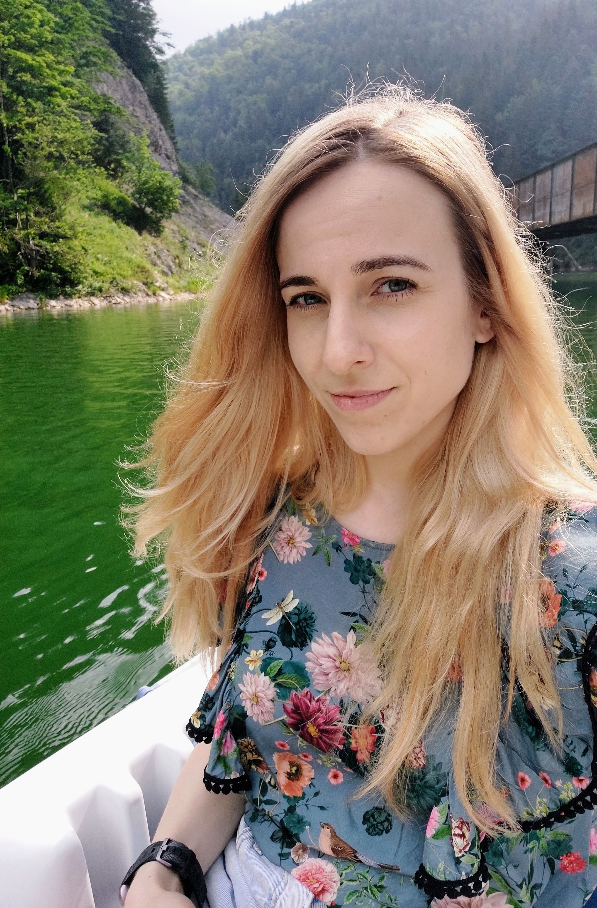

 

 Welcome! My name is Dominika Maslarova. I am a PhD student of Physical Engineering at the Faculty of Nuclear Sciences and Physical Engineering.
I have been simultaneously working as a researcher at the Institute of Plasma Physics of Czech Academy of Sciences.
My research interests include laser-driven plasma-based particle accelerators and radiation sources. I have experience with performing kinetic numerical simulations on large-scale HPC supercomputers.

<!-- 
#This site serves as an example for the Bay Jekyll theme. Bay is a very simple and minimal theme, directly inspired by Dan Grover's <a href="http://dangrover.com">website</a>.
-->

Research highlights:
  - <b>Creation and generation with next-generation multi-PW laser pulses</b>
  - <strong>Kick the electrons at the plasma grid</strong>
  - Let electrons wiggle more
  - Trap electrons with an unconventional laser pulse

Current employers:
  - Institute of Plasma Physics of Czech Academy of Sciences since 2017
  - Faculty of Nuclear Sciences and Physical Engineering of Czech Technical University in Prague

